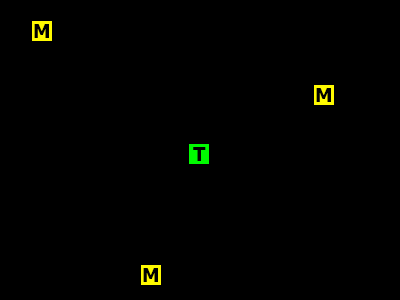
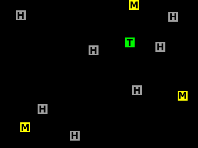
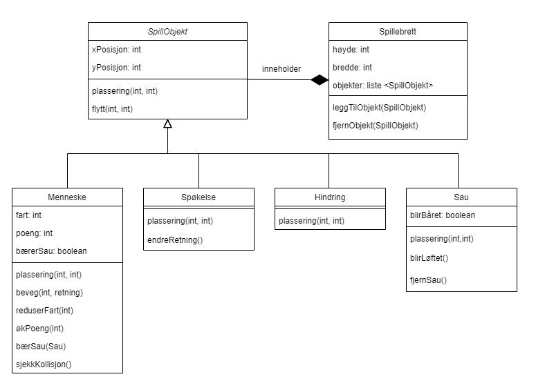

# Oppgaver - Spillutvikling

## 4.1 - Pactroll

> Eksamen V23 - Oppgave 10

I denne oppgaven skal du utvikle et spill som vi har kalt PacTroll.
Du bør sette av om lag to timer til denne oppgaven.

Spillet starter med et spillbrett (svart hovedboks), et troll (grønn boks merket T) og tre matbiter (gule bokser merket M) – se illustrasjonen nedenfor til venstre.
Trollet skal bevege seg på spillbrettet og spise så mange matbiter som mulig.
Trollet har en konstant fart og kan ikke stoppes, men spilleren styrer retningen ved å bruke tastaturet.
Hver gang en matbit spises, blir den gjort om til en hindring (grå boks merket H), og en ny matbit plasseres ut på spillbrettet – se illustrasjonen nedenfor.

Hvis trollet treffer en av hindringene eller spillbrettets kanter, avsluttes spillet.

### Funksjonelle krav

- Ved oppstart skal grensesnittet se ut omtrent som i illustrasjonen ovenfor til venstre. Spillet skal bestå av et spillbrett, et trollobjekt og tre matobjekter. (Du kan utelate bokstavene på boksene.)
- Ved oppstart plasseres matobjektene på tre tilfeldige plasseringer på spillbrettet, og trollobjektet plasseres i sentrum. Ingen objekter skal være oppå hverandre.
- Trollobjektet beveger seg i rolig hastighet i en retning, enten opp, ned, til venstre eller til høyre. Retningen trollobjektet beveger seg i, styres med piltaster (alternativt tastene W, S, A og D).
- Når trollobjektet treffer et matobjekt, skal det følgende skje:
  - Spilleren får et poeng.
  - Matobjektet gjøres om til et hindringsobjekt som trollobjektet ikke skal treffe igjen.
  - Et nytt matobjekt opprettes et tilfeldig sted på spillbrettet, slik at det alltid er tre matobjekter på spillbrettet. Nye matobjekter skal ikke plasseres på allerede eksisterende objekter.
  - Farten til trollobjektet økes.
- Antallet poeng spilleren har, skal hele tiden være synlig i grensesnittet.
- Spillet avsluttes om trollobjektet treffer en av spillbrettets kanter eller et av hindringsobjektene.

### Oppdrag

1. Lag et klassediagram der du definerer nødvendige klasser, med egenskaper og metoder, for å implementere/lage spillet.
2. Implementer/lag spillet i samsvar med klassediagrammet.

## 4.2 - Manic Mansion

> Inspirert av eksamen H23 - Oppgave 12

I denne oppgaven skal du utvikle et spill som heter Manic Mansion.

I Manic Mansion styrer spilleren et menneske som prøver å hente hjem sauene sine en etter en.
På veien må mennesket ta seg forbi hindringer og unngå å bli tatt av spøkelser.

Spillet starter med et spillebrett, et menneske, et spøkelse, tre hindringer og tre sauer.
Mennesket skal styres av spilleren, og målet med spillet er å komme seg over på den andre siden av brettet og hente en sau flest mulig ganger uten å være i kontakt med noen av spøkelsene.

Du bør sette av om lag to timer til denne oppgaven.

### Krav

- Ved oppstart skal spillet bestå av et spillebrett, et menneskeobjekt, et spøkelsesobjekt, tre hindringsobjekter og tre saueobjekter.
- Det skal være en liten frisone både på venstre og høyre side av spillebrettet hvor kun mennesker og sauer kan oppholde seg, mens det ikke kan være spøkelser eller hindringer der.
- Spøkelses- og hindringsobjektene plasseres på tilfeldige steder på spillebrettet, menneskeobjektet i frisonen på venstre side av spillebrettet og sauene på tilfeldige steder i frisonen på høyre side av spillebrettet. Ingen objekter skal være oppå hverandre.
- Ulike typer objekter skal være visuelt forskjellige.
- Menneskeobjektet starter i ro og kan bevege seg i rolig hastighet opp, ned, til venstre eller til høyre. Retningen styres med piltaster (alternativt tastene W, S, A og D).
- Spøkelsesobjektene starter på et tilfeldig sted på spillebrettet, men altså ikke i noen av frisonene. Spøkelsesobjektene beveger seg med konstart fart i en tilfeldig retning. Spøkelsesobjektene kan bevege seg på skrå i flere forskjellige vinkler. Når et spøkelse treffer kanten av spillebrettet eller kanten på en av frisonene, endrer spøkelset retning. Spøkelset blokkeres ikke av hindringer eller av andre spøkelser, men går tvers gjennom dem.
- Når menneskeobjektet treffer en hinding eller kanten av spillebrettet, blokkeres menneskeobjektet helt til retningen endres.
- Når menneskeobjektet treffer et saueobjekt, skal det følgende skje:
  - Saueobjektet fjernes fra spillebrettet (dette representerer at mennesket bærer sauen). (Alternativt: Saueobjektet «festes» til menneskeobjektet og følger mennesekeobjektets bevegelser.)
  - Farten til menneskeobjektet reduseres.
  - Fram til saueobjektet er levert på den andre siden, vil en kollisjon mellom menneskeobjektet og et annet saueobjekt føre til at spillet stoppes.
- Når menneskeobjektet kommer tilbake til startsonen på venstre side av spillebrettet, skal det følgende skje:
  - Spilleren får et poeng.
  - Farten til menneskeobjektet økes til samme fart som ved spillets start.
  - Et nytt saueobjekt plasseres et tilfeldig sted i frisonen til høyre på spillebrettet.
  - Et nytt spøkelsesobjekt og et nytt hindringsobjekt plasseres på tilfeldige steder på spillebrettet.
- Når menneskeobjektet, med eller uten sau, treffer et spøkelsesobjekt, skal spillet stoppes.

### Oppgave

På figuren under ser du et forslag til en objektorientert modell for spillet.

1. Tegn en skisse av spillet (Bruk [exalidraw.cow](https://excalidraw.com/) eller [draw.io / diagrams.net](https://app.diagrams.net/))
2. Lag et UML-diagram som viser en oversikt over spillets klasser
3. Lag spillet
